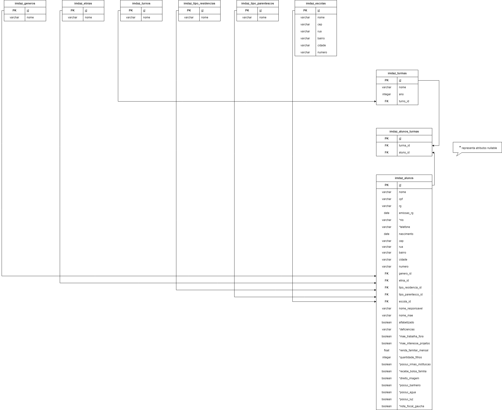

<div align="center">
    <br>
    <h1 align="center"> API IMDAZ</h1>
    <p align="center">
        <a href="#sobre-o-desafio">Sobre</a> | 
	<a href="#ambiente-local">Ambiente</a> | <a href="#banco-de-dados">Banco de dados</a>
    </p>
    <p align="center"> 
        <i><h5>Criação de uma api para o Instituto de Menores Dom Antônio Zattera</a></h5></i
    </p>
</div>
<br>

## Sobre o projeto
Foi desenvolvido uma API para substituir o uso do excel para guardar e manipular os dados do IMDAZ, com algumas rotas e funcionalidades, utilizando php e mysql. 


##### Tecnologias utilizadas:
- PHP
- MySQL

##### Pré requisitos:
- <a href="https://www.apachefriends.org/pt_br/download.html">XAMPP</a>
- <a href="https://www.postman.com/downloads/">POSTMAN</a>

## Ambiente local
Primeiramente, você deve clonar o projeto de api na sua máquina ou realizar o download. É ideal que essa api seja colocada em seu servidor, caso utilize o XAMPP, coloque na pasta htdocs.

```sh
git clone https://github.com/will1Zera/IMDAZ.git
```

## Executando a api
Depois de clonar ou baixar o projeto, você deve configurar seu servidor, caso utilize o XAMPP, deve ativar o Apache e MySQL no Painel de Controle. Para testar se ocorreu tudo certo, poderá acessar a seguinte rota no navegador:

```sh
http://localhost/imdaz/api
```
Em caso de sucesso, é retornado a seguinte mensagem: "Welcome to the IMDAZ api!".

## Banco de dados
1. Acesse o arquivo Database.php e realize a conexão com seu banco de dados.
2. Para criar as tabelas listadas abaixo, acesse `api/src/Utils` e execute o seguinte comando:
   
```sh
php Migrations.php
```
### Diagrama do banco de dados

<p align="center">
  
</p>


## Importante
1. Para que ocorra tudo certo, siga a ordem correta de comandos listados.
2. Muita atenção aos pré-requisitos listados!


<br>
by <a href="https://github.com/will1Zera">William Bierhals</a> 😄 <br>
📥 <a href="https://www.linkedin.com/in/williambierhals/">Linkedin</a>